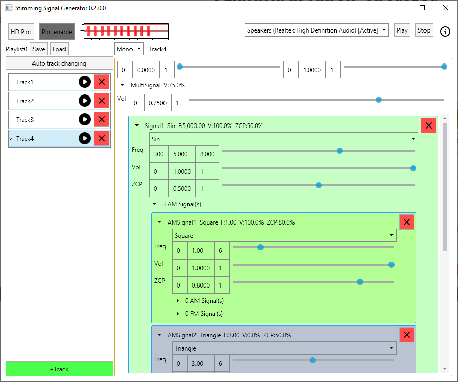
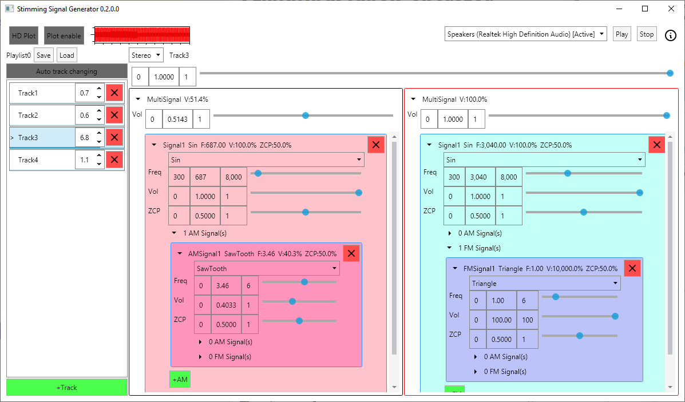

# StimmingSignalGenerator

This software basically generate real-time audio signal.

Control slider can adjust max-min value for precise control.  
Basic signal can control frequency, gain, zero crossing position and add FM and AM.

#### Zero Crossing Position(ZCP)
zero crossing position(ZCP) is for control signal positive, negative period.  
Usually combine with AM square wave to control on off period.  
ZCP 0.2 mean on 20% and off 80%.

#### Right click to copy, paste
Signal and Track can be copy to clipboard (right click on signal header) and paste (right click on add signal button).  
Control slider can also do copy paste value.  
Copy value is basically text(json) and can paste across playlist.

#### Mono, Stereo
Mono mode use one signal for both L,R but can control volume of each channel.  
Stereo mode have different signal on each channel.

#### Track
Track order can be change by drag and drop.  
To edit track name select track in playlist and click track name on the right side(track header) to enter edit mode.

#### Default playlist
When startup it will load first playlist file sort by file name.

### screenshot

