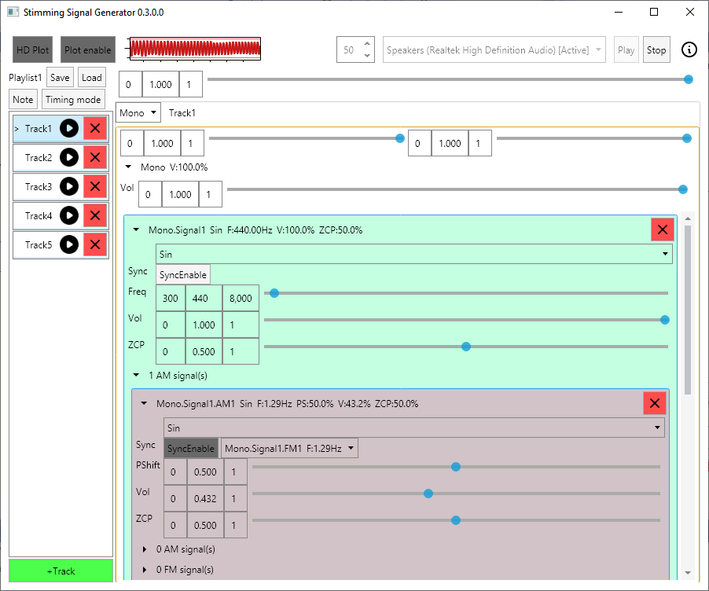
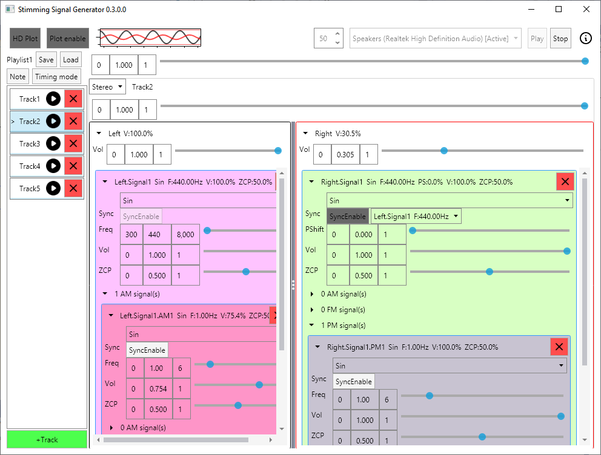

# StimmingSignalGenerator
This software basically generate real-time audio signal.  
### screenshot




## Running StimmingSignalGenerator
#### To run on Windows
1. Install [.NET Core 3.1 Desktop Runtime](https://dot.net).
2. Download binary in [releases page](https://github.com/haiyaku365/StimmingSignalGenerator/releases)
3. run exe

#### To run on Linux
1. Install [.NET Core 3.1 runtime](https://dot.net)
2. Install OpenAL lib
```
sudo apt install libopenal1
```
3. Download binary in [releases page](https://github.com/haiyaku365/StimmingSignalGenerator/releases)
4. run
```
dotnet PathToApp/StimmingSignalGenerator.dll
```
#### To run from source
1. Install [.NET Core 3.1 SDK](https://dot.net)
2. clone
```
git clone https://github.com/haiyaku365/StimmingSignalGenerator.git
```
3. run
```
cd StimmingSignalGenerator/StimmingSignalGenerator
dotnet run
```

## Using StimmingSignalGenerator
#### Basic signal 
Basic signal can control frequency, gain, 
zero crossing position and add FM, AM and PM.

#### Zero Crossing Position(ZCP)
zero crossing position(ZCP) is for control signal positive, negative period.  
Usually combine with AM square wave to control on off period.  
ZCP 0.2 mean on 20% and off 80%.

#### Sync
When sync with another signal, 
frequency will be in sync and phase shift control will appear.

#### Control slider
Control slider can adjust max-min value for precise control.  
Input value in box commit when hit enter or lost focus and cancel when hit esc.  
When focus input box using mouse scroll will change it value.

#### Right click to copy, paste
Signal and Track can be copy to clipboard (right click on signal header) and paste (right click on add signal button).  
Control slider can also do copy paste value.  
Copy value is basically text(json) and can paste across playlist.

#### Mono, Stereo
Mono mode use one signal for both L,R but can control volume of each channel.  
Stereo mode have different signal on each channel.

#### Track
Track order can be change by drag and drop.  
To edit track name select track in playlist and click track name on the right side(track header) to enter edit mode.

#### Plot
Enable plot to plot output signal.  
Enable HD Plot will plot in High definition in cost of more cpu.  
Use mouse scroll to zoom in, out.

#### Hot key
*Toggle Play, Stop:* Ctrl+~  
*Play track:* Ctrl+1, Ctrl+2, ... , Ctrl+0

#### Note
Note that save along with playlist.

#### Default playlist
When startup it will load first playlist file sort by file name.


